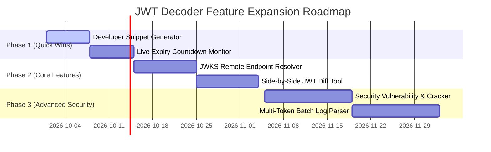

# 🚀 Feature Proposals & Enhancement Roadmap for JWT Decoder

An actionable feature roadmap and specification guide for expanding **JWT Decoder** into an enterprise-grade JWT Debugging, Security Auditing, and Developer Productivity Platform.

---

## 📋 Executive Summary

The current JWT Decoder offers robust client-side and backend decoding, asymmetric/symmetric signature verification, security scanning, HMAC token generation, and PDF export.

To evolve from a basic utility into an **all-in-one Identity & Security Debugging Platform**, this document outlines **7 high-impact feature proposals** with complete specifications, user stories, architecture designs, and implementation steps.

---

## 🎯 Proposed Features Overview

| # | Feature Name | Category | Value Proposition |
|---|--------------|----------|-------------------|
| 1 | **JWKS Remote Endpoint Auto-Resolver** | Integration | Automatically fetch public keys from Auth0, Okta, Firebase, Cognito, Keycloak to verify tokens |
| 2 | **Automated JWT Security Testing & Cracker** | Security | Detect weak HMAC secrets, test for `alg: none` vulnerabilities & key confusion attacks |
| 3 | **Side-by-Side JWT Diff & Claim Inspector** | DX / Debugging | Compare two tokens (e.g. Access Token vs Refresh Token, or Before vs After role changes) |
| 4 | **Live Expiry & Session Lifecycle Monitor** | UI / UX | Visual countdown bars, real-time clock validation, and audio/toast warnings for expired tokens |
| 5 | **Multi-Token Batch Parser & Log Analyzer** | Enterprise | Upload server logs / HAR files, extract all JWTs, and view batch security & expiry reports |
| 6 | **Developer Integration Snippet Generator** | Productivity | 1-click export token as cURL, Postman headers, Python `requests`, Node `axios`, or Go snippets |
| 7 | **OAuth 2.0 / OIDC Flow Simulator** | Protocol | Interactive playground for testing Authorization Code + PKCE, Implicit, and Client Credentials flows |

---

## 📑 Detailed Feature Specifications

### 1. 🌐 JWKS (JSON Web Key Set) Remote Endpoint Auto-Resolver

#### Description
Identity providers like Auth0, Okta, Firebase, AWS Cognito, Keycloak, Google, and Azure AD publish public keys via a `/.well-known/jwks.json` endpoint. This feature lets users input a JWKS URL or auto-detect it from the `iss` (Issuer) claim in the token.

#### Key Functionality
- **Auto-Discovery:** Automatically read the `iss` claim (e.g., `https://dev-1234.us.auth0.com/`) and construct `https://dev-1234.us.auth0.com/.well-known/jwks.json`.
- **Key Matching:** Match the token's `kid` (Key ID) header against the keys inside the fetched JWKS payload.
- **Auto-Verification:** Select the matching RSA/ECDSA key automatically and trigger signature verification without needing manual PEM copying.

#### Backend API Additions
```http
POST /verify-jwks
Content-Type: application/json

{
  "token": "<JWT_TOKEN>",
  "jwks_url": "https://example.us.auth0.com/.well-known/jwks.json"
}
```

---

### 2. 🛡️ Security Vulnerability Testing & Weak Secret Cracker

#### Description
Integrate a lightweight vulnerability simulator and dictionary attack engine to test token security strength before production deployment.

#### Key Functionality
- **Weak Secret Cracker:** Test HMAC tokens against a dictionary of top 10,000 common secrets (e.g. `secret`, `123456`, `password`, `admin`, `app_secret`, `jwt_secret`) directly in browser Web Workers or FastAPI background thread.
- **Algorithm Misconfiguration Tests:**
  - Test if server would accept `alg: "none"` algorithm.
  - Test Algorithm Confusion attack (signing RS256 token with HMAC using public key).
- **Claim Vulnerability Alerts:** Flag missing standard security claims (`exp`, `nbf`, `iat`, `aud`, `iss`).

---

### 3. 🔍 Side-by-Side JWT Diff & Claim Comparison Tool

#### Description
A split-screen comparison mode to compare two JWT tokens side by side. Ideal for backend developers debugging token permission changes, role escalation issues, or token refresh differences.

#### Key Functionality
- **Dual Pane Viewer:** Token A vs Token B.
- **Diff Highlighting:**
  - 🟢 Green: Added claims in Token B.
  - 🔴 Red: Removed claims from Token A.
  - 🟡 Yellow: Modified claim values (e.g. changed `exp`, changed user roles).
- **Time Difference Calculation:** Highlights exact difference in expiration duration between the two tokens (e.g., "+2 hours duration").

---

### 4. ⏱️ Live Expiry & Session Lifecycle Monitor

#### Description
Dynamic real-time timeline viewer for tracking token state and remaining lifetime.

#### Key Functionality
- **Visual Progress Bar:** Shows total valid duration (`iat` to `exp`), elapsed time percentage, and time remaining.
- **Live Countdown:** Real-time clock counting down `00h 14m 32s remaining`.
- **NBF Status Indicator:** Explicit notification if the token is `Not Yet Valid` (`nbf` in future).
- **Browser Notifications:** Optional browser alert when an inspected token expires during active testing.

---

### 5. 📂 Multi-Token Batch Parser & Log Analyzer

#### Description
Bulk upload tool allowing developers and DevOps engineers to extract and audit JWT tokens from server log files, HTTP archives (HAR), or cURL dumps.

#### Key Functionality
- **Drag & Drop Upload:** Support `.txt`, `.log`, `.har`, and `.csv` files.
- **Regex JWT Extraction:** Automatically isolate string patterns matching standard JWT format (`eyJ...`).
- **Batch Table Dashboard:**
  - Token Summary (Subject, Issuer, Algorithm, Expiration Date).
  - Status Pills: `Valid`, `Expired`, `Weak Signature`, `Invalid Format`.
- **Export Options:** Export batch audit report as CSV, JSON, or executive PDF.

---

### 6. 🚀 Developer Integration Snippet Generator

#### Description
Transform inspected JWT tokens into ready-to-use code snippets and request headers for popular tools and frameworks.

#### Supported Export Formats
- **cURL:** `curl -H "Authorization: Bearer eyJ..." https://api.example.com/v1/resource`
- **Postman / Insomnia:** Export JSON environment variable block.
- **JavaScript (Fetch / Axios):** Copy code block with configured `headers`.
- **Python (Requests / HTTPX):** Ready-to-paste Python request code.
- **Go / Rust / Java Snippets:** Standard header injection templates.

---

### 7. 🔐 Interactive OAuth 2.0 / OIDC Flow Debugging Playground

#### Description
An interactive protocol sandbox allowing developers to initiate standard OAuth2 flows and decode the resulting Access Tokens and ID Tokens in one unified interface.

#### Supported OAuth2 Flows
- **Authorization Code Flow + PKCE** (Proof Key for Code Exchange)
- **Implicit Flow** (Legacy token inspection)
- **Client Credentials Flow** (Machine-to-Machine authentication)

---

## 🛠️ Recommended Implementation Roadmap



---

## 💡 Tech Stack Recommendations for Expansion

- **Frontend:** React + Tailwind CSS + `lucide-react` (icons) + Web Workers (for non-blocking dictionary cracking).
- **Backend:** FastAPI + `python-jose` + `httpx` (async JWKS HTTP fetching) + `ReportLab` (PDF enhancement).
- **State & Storage:** `indexedDB` or `localStorage` for saved token presets & token comparison history.

---

*Document generated for **JWT Decoder Project**.*
